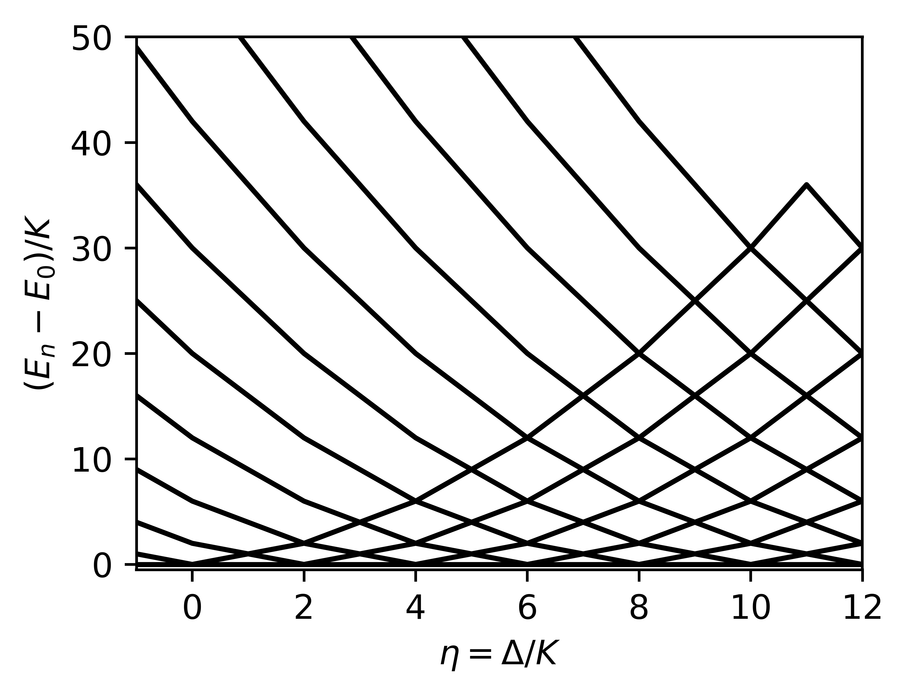

## April 11 2023
### Jaya with Prof. Iachello

The Delta-Kerr-cat is defined by the Hamiltonian \footnote{hi}
$$
H =-\Delta a^\dagger a + K a^{\dagger 2} a^2 - \epsilon_2 (a^{\dagger 2} + a^2). \qquad \qquad \qquad (1)
$$
As a function of $\Delta$, the spectrum of this Hamiltonian exhibits degeneracies. Specifically for any value of $\epsilon_2$, the spectrum experiences $m+1$ degeneracies when $\eta = \Delta/K = 2m$, for non-negative integer $m$.

Spectrum of $H$ for $\epsilon_2/K = 2$.

How do these degeneracies manifest in the Lindbladian? Investigating this is the purpose of the notes. Physically, the Lindbladian is one of the general forms of [Markovian](https://en.wikipedia.org/wiki/Markov_process "Markov process") [master equations](https://en.wikipedia.org/wiki/Quantum_master_equation "Quantum master equation") describing open quantum systems. The resulting dynamics is no longer unitary, but still satisfies the property of being [trace-preserving and completely positive](https://en.wikipedia.org/wiki/Completely_positive_trace-preserving "Completely positive trace-preserving") for any initial condition. In this note, we will look at the following Lindblad master equation with single-photon loss and gain:

$$
\begin{align}
\dot{\rho} = \mathcal L \rho = (\mathcal L_H + \mathcal L_D) \rho,
\end{align}
$$
where 
$$
\begin{align}
\mathcal {L}_H\, \cdot = \frac{1}{i \hbar} [H,\, \cdot],
\end{align}
$$
$H$ being given by the Equation (1) above, and 
$$
\begin{align}
\mathcal L_D\, \cdot= \kappa (1+ n_{\mathrm{th}}) \mathcal D [a]\,\cdot + \kappa n_{\mathrm{th}} \mathcal D [a^\dagger]\,\cdot.
\end{align}
$$

The density matrix $|\rho\rangle$ is a vector and the Lindbladian $\mathcal L$ is the matrix representation of a superoperator in the Fock-Liouville space.

Here $\kappa$ is the rate of single-photon loss to the environment and $n_{\mathrm{th}}$ is the average number of thermal photons.

The sought-after task is to understand how the degeneracies affect the decoherence dynamics, specifically the structure of $\mathcal L$.

To start the problem, let us consider the spectrum for $\epsilon_2/K = 0$. In this case the Fock states $|n\rangle$ are the eigenstates of $H$.
Spectrum of $H$ for $\epsilon_2/K = 0$.

The spectrum of $H$ for $\epsilon_2/K = 0$ is explained by evaluating the expectation value of the Fock states $|n\rangle$ over $H_0/K =-\eta a^\dagger a +  a^{\dagger 2} a^2.$  This is given by
$$
\begin{align}
E_{0n}/K = -\eta n +  n (n -1).
\end{align}
$$
For a degeneracy in the spectrum between states with index $n$ and $m$, we have
$$
\begin{align}
E_{0n}/K &= E_{0m}/K \\
\implies -\eta n +  n (n -1) &= -\eta m +  m(m-1) \\
\eta (n-m) &= (n^2 - m^2) - (n - m) \\
\eta &= (n + m - 1).
\end{align}
$$
When $m = n+1$, we have $\eta = 2n$, and when $m = n+2$, we have $\eta = 2n+1$.

More generally, when $n + m = 2k+1$, we have $\eta = 2k$, and when $n + m = 2k+2$, we have $\eta = 2k + 1$, for $k >= 0$. In summary, two states with odd joint parity will cross at even $\eta$ and two states with even joint parity will cross at odd eta.

Now, how can we explain the Lindblad spectrum and the well-flip lifetime?

![[Pasted image 20230413205004.png]]